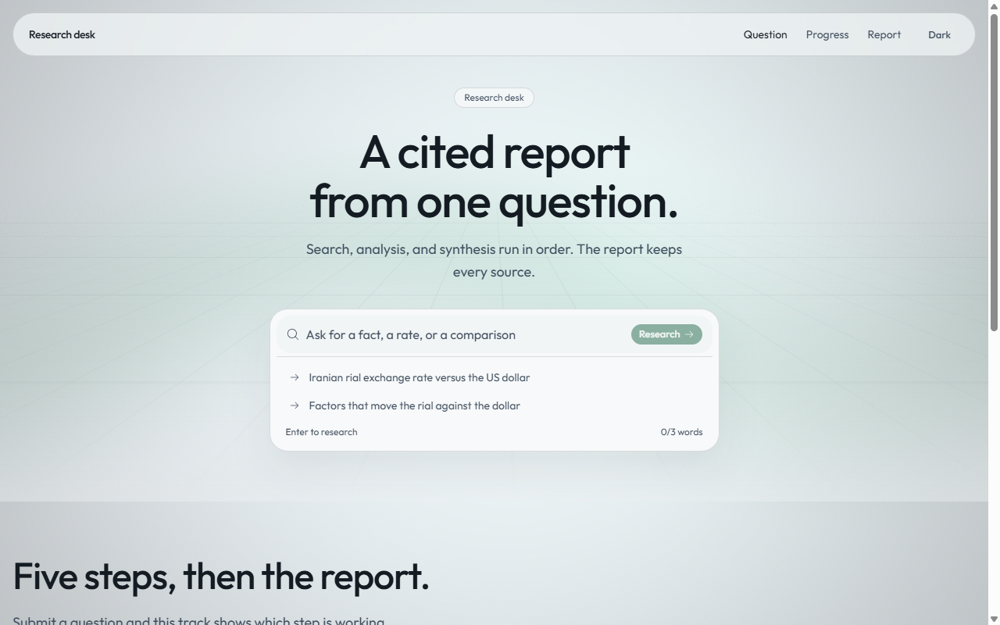
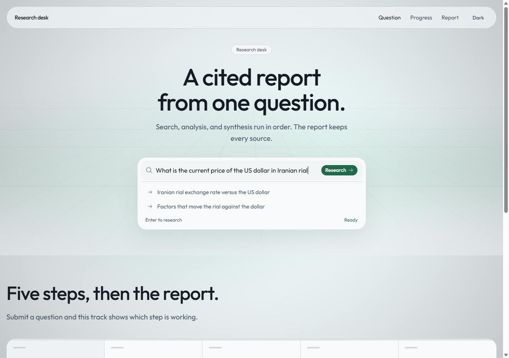
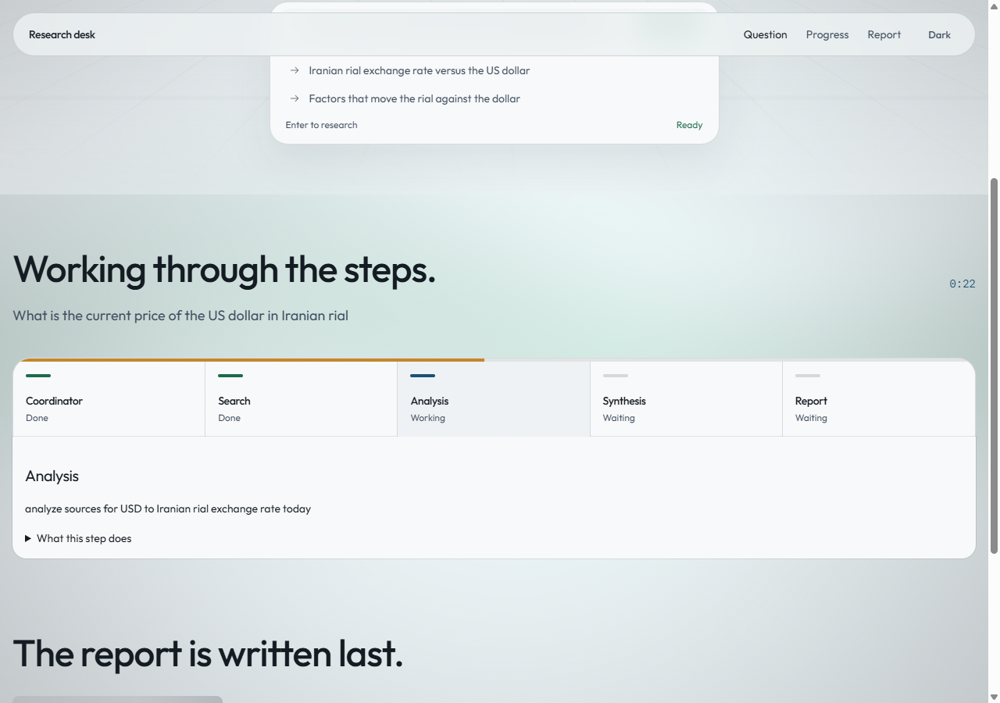
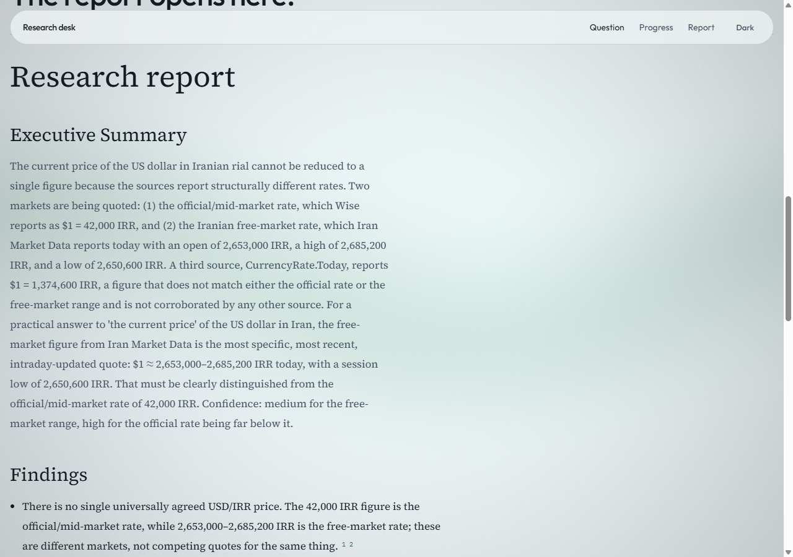
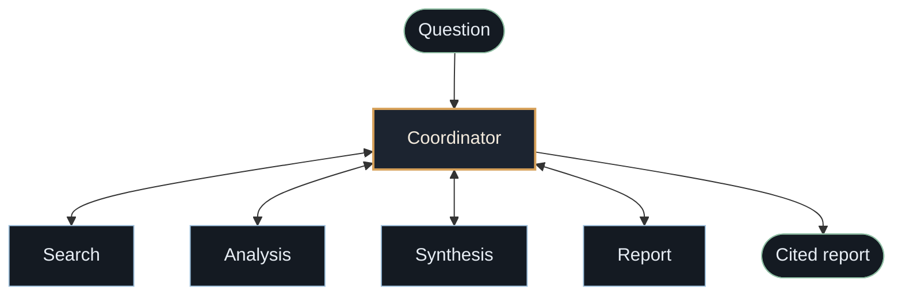
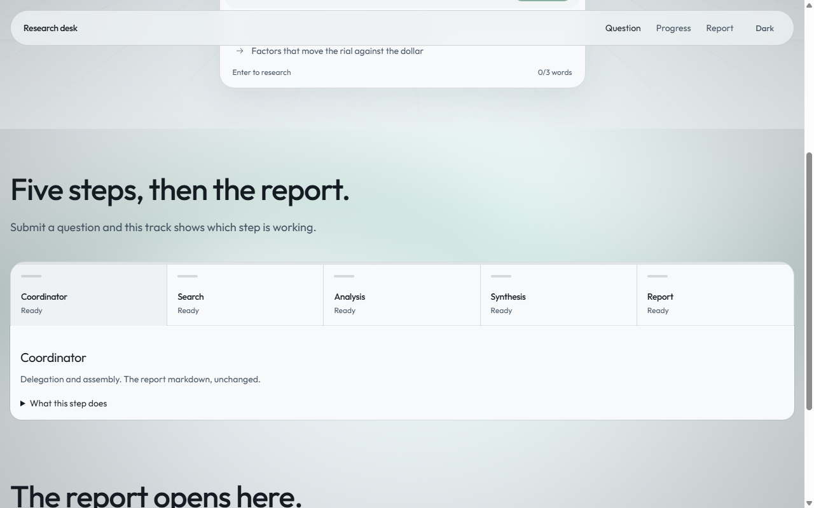

# multi-agent research system

[](https://www.python.org/downloads/)
[](https://docs.langchain.com/oss/python/langgraph/overview)
[](https://nextjs.org/)
[](LICENSE)

Ask one question. The coordinator talks to four specialists and returns a cited Markdown report. Specialists never call each other.



## A run

Question: what is the current price of the US dollar in Iranian rial?



While the coordinator is still calling specialists, the track shows who is done and who is working.



The report answers that question. It does not collapse the price into one number. Wise states an official rate of 42,000 IRR per dollar. Iran Market Data states a free-market open of 2,653,000 IRR. A third figure, 1,374,600 IRR, stays unresolved.



## What you get

A finished run is one Markdown report:

- a title and an executive summary that answers the question
- findings, each one tied to source numbers
- conflicts left standing when the sources disagree
- confidence, gaps, and a numbered reference list with URLs

The report cites only URLs the search step returned. If a model draft fails that check, a fallback report is built from the synthesis so the run still ends with a document.

## Architecture

The coordinator is the only speaker. Search returns sources to the coordinator. The coordinator sends that set to analysis. After every analysis is back, the coordinator calls synthesis, then the report agent, and returns that Markdown unchanged.



1. The coordinator splits the question into one or two search queries.
2. For each query it calls search, takes the sources back, then calls analysis.
3. It calls synthesis once with every analysis, then calls the report agent once.
4. It returns that Markdown unchanged.

| Step | Talks to | Does | Does not |
| --- | --- | --- | --- |
| Coordinator | Search, analysis, synthesis, report | Split the request, pass each result onward, return the report | Search, analyze, synthesize, or edit the report |
| Search | Coordinator only | One web lookup per query, then a short page excerpt | Draw conclusions or call another agent |
| Analysis | Coordinator only | Claims, disagreements, and gaps, each claim tied to a URL | Search the web or resolve conflicts |
| Synthesis | Coordinator only | One picture across the analyses, with confidence | Add new sources or average competing numbers |
| Report | Coordinator only | Markdown with numbered citations | Invent URLs or call another agent |

Search hits are collected directly, then the top pages are read for a short passage that contains a number when the page has one. Analysis, synthesis, and the report are each a single model call. The default model is DeepSeek V4.1 Flash on [OpenCode Zen](https://opencode.ai/zen/v1).



The amber bar advances one fifth per finished step. The active step adds only a partial advance. Blue means working. Green means done.

## Layout

```
packages/research     coordinator hub and the four specialists
apps/dashboard        Next.js desk
scripts/run_research.py
```

## Setup

```bash
uv sync
cp .env.example .env
```

Set `OPENCODE_API_KEY` in `.env`. A `provider:model` string such as `openai:gpt-4.1` still goes through that LangChain provider.

```python
from research import run_coordinator

result = run_coordinator("What is the current price of the US dollar in Iranian rial?")
print(result["answer"])
```

Desk:

```bash
cd apps/dashboard
npm install
npx next dev -p 3000
```

Open `http://localhost:3000`. The question needs at least three words. Progress streams from `POST /api/research`.

## Checks

```bash
uv run ruff check .
uv run ruff format --check .
uv run pytest
```

## Commits

Lowercase, one line, conventional:

```
feat: add research lead agent
fix: pass tools through to subagents
```

Types: `feat`, `fix`, `docs`, `refactor`, `test`, `chore`.
